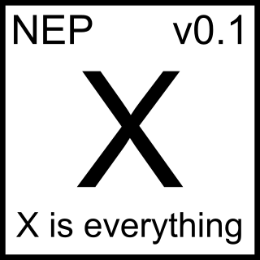

# `nepx`

## What is `nepx`?

A tools to process the outputdata from NEP, include the MD part from GPUMD. NEPX, x is everything.

## Manual

ready to write soon.

## Tool list

* [Units conversion](http://greif.geo.berkeley.edu/~driver/conversions.html)

## References

